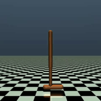
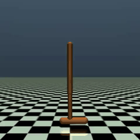
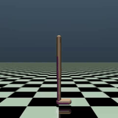
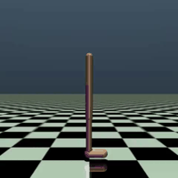

# DQN & Rainbow DQN — Pixel Control in MuJoCo

This repository trains **DQN** and **Rainbow DQN** agents on continuous-control MuJoCo tasks (Hopper, Walker2d, Humanoid) using **pixel observations** — raw 84 × 84 grayscale frames, stacked and fed to a convolutional network. State-based observation mode is also supported.

## Results — DQN vs Rainbow DQN

<table>
<tr>
<th></th>
<th>Vanilla DQN (pixel)</th>
<th>Rainbow DQN (pixel)</th>
</tr>
<tr>
<td><strong>Hopper-v5</strong></td>
<td><br/>Best reward: <strong>918</strong></td>
<td><br/>Best reward: <strong>3692</strong></td>
</tr>
<tr>
<td><strong>Walker2d-v5</strong></td>
<td><br/>Best reward: <strong>1683</strong></td>
<td><br/>Best reward: <strong>5847</strong></td>
</tr>
</table>

Rainbow DQN achieves **~4x** the reward of vanilla DQN on Hopper and **~3.5x** on Walker2d from raw pixels.

## Theoretical background

### Deep Q-Learning (DQN)

The core idea is to approximate the optimal action-value function $Q^{\ast}(s, a)$ with a neural network $Q(s, a; \theta)$.

**Bellman optimality equation:**

$$Q^{\ast}(s, a) = \mathbb{E}\left[r + \gamma \max_{a'} Q^{\ast}(s', a') \mid s, a\right]$$

**TD target** (with target network $\theta^-$):

$$y = r + \gamma \max_{a'} Q(s', a'; \theta^-)$$

**Loss:**

$$L(\theta) = \mathbb{E}\left[(y - Q(s, a; \theta))^2\right]$$

**Stability mechanisms:**
- **Experience replay** — store transitions $(s, a, r, s', done)$ and sample mini-batches to break temporal correlation.
- **Target network** — periodically sync weights to stabilize the TD target.

### Rainbow DQN extensions

Six improvements toggled independently via `configs/hyperparameters.yml`:

| Flag | Technique | Key idea |
|---|---|---|
| `enable_double_dqn` | Double DQN | Decouple action selection from evaluation to reduce Q-value overestimation |
| `enable_dueling_dqn` | Dueling architecture | Separate value $V(s)$ and advantage $A(s,a)$ streams |
| `enable_prioritized_replay` | Prioritized Experience Replay | Sample transitions with high TD-error more often |
| `enable_noisy_nets` | NoisyNets | Replace $\epsilon$-greedy with learned parametric noise in linear layers |
| `enable_distributional` | C51 (Categorical DQN) | Model the full return distribution instead of just $\mathbb{E}[Q]$ |
| `enable_n_step` | Multi-step returns | Bootstrap from $n$-step accumulated rewards |

When **any** Rainbow flag is enabled the CLI automatically uses `RainbowAgent`; otherwise it falls back to the lightweight `DQNAgent`.

## Environment wrappers & optimizations

### Action discretization

MuJoCo environments have continuous action spaces. Since DQN requires discrete actions, `DiscretizedActionWrapper` converts each actuator dimension into `bins` discrete values (default 3: min, 0, max), plus a shared "do nothing" zero-action. For Hopper (3 actuators, bins=3) this produces 7 discrete actions.

### Pixel observation pipeline

For pixel mode, the observation pipeline stacks several wrappers:

1. **Render at 84 × 84** — the env is created with `width=84, height=84` directly, avoiding expensive high-res render + resize.
2. **`RenderGrayscaleWrapper`** — converts RGB frames to single-channel grayscale via `cv2.cvtColor`, outputting `uint8` observations.
3. **`FrameStackObservation(stack_size=4)`** — stacks the last 4 frames, giving the network temporal information (velocity, direction).
4. **`EvalRenderWrapper`** (eval only) — creates a separate high-res MuJoCo renderer for display without affecting the 84 × 84 observation pipeline.

### Frozen joints (Humanoid)

`FrozenJointsWrapper` zeros out specified actuator indices and exposes only the remaining ones to the agent. Used for Humanoid to freeze arms and certain hip joints, reducing the discrete action space from impractically large to manageable.

### Training optimizations

| Optimization | Description |
|---|---|
| **Mixed-precision training (AMP)** | `torch.amp.autocast` + `GradScaler` on CUDA — forward pass in float16, stable gradients in float32 |
| **uint8 replay buffer** | Pixel observations stored as `uint8` in NumPy, cast to `float32` only when transferred to GPU for training |
| **Pre-allocated circular buffer** | Fixed-size NumPy arrays instead of Python lists — no per-sample allocation overhead |
| **`max_episode_steps = 20000`** | Extended episode horizon (default is 1000) to allow the agent to learn long-horizon locomotion |
| **`train_frequency = 4`** | One gradient step every 4 env steps — reduces training compute while collecting more diverse data |
| ~~**Vectorized environments**~~ | ~~`gymnasium.vector.SyncVectorEnv` for parallel data collection~~ — removed after benchmarking showed no improvement despite higher steps/sec |

### CNN architecture (Pixel_DQN)

The pixel network follows the classic DQN convolutional architecture:

```
Input: [B, 4, 84, 84] (4 grayscale frames)
  → Conv2d(4, 32, 8×8, stride=4) → ReLU
  → Conv2d(32, 64, 4×4, stride=2) → ReLU
  → Conv2d(64, 64, 3×3, stride=1) → ReLU
  → Flatten → Linear(3136, action_dim)
```

With dueling architecture enabled, the final layer splits into value and advantage streams.

## Repository structure

```
.
├── main.py                        # CLI entry point (train / evaluate)
├── pyproject.toml                 # Dependencies and project metadata
├── configs/
│   └── hyperparameters.yml        # All run presets and hyperparameters
├── assets/                        # GIFs for README
├── runs/                          # Generated outputs (one folder per preset)
│   └── <preset_name>/
│       ├── config.yml             # Frozen copy of the configuration used
│       ├── best_model.pt          # Best model weights (by episodic return)
│       ├── checkpoint.pt          # Full training state (resumable)
│       ├── training.log           # Timestamped training log
│       ├── graph.png              # Reward + epsilon decay plot
│       ├── tensorboard/           # TensorBoard event files
│       └── eval/
│           ├── best.mp4           # Best evaluation episode video
│           └── best_reward.txt    # Corresponding reward
├── src/
│   ├── buffer.py                  # ExperienceReplay (pre-allocated circular buffer)
│   ├── networks.py                # DQN (MLP), Pixel_DQN (CNN), NoisyLinear
│   ├── utils.py                   # Config loading, device selection, plotting
│   ├── wrappers.py                # Env wrappers + factory (make_env)
│   ├── dqn/
│   │   └── train.py               # DQNAgent — vanilla DQN training loop
│   └── rainbow/
│       └── train.py               # RainbowAgent — Rainbow DQN (inherits DQNAgent)
└── Report/                        # LaTeX academic report
```

### What gets saved to `runs/`?

Each preset creates its own folder under `runs/<preset_name>/` containing:

| File | Description |
|---|---|
| `config.yml` | Frozen copy of the hyperparameters used for the run |
| `best_model.pt` | Model weights with the highest episodic return so far |
| `checkpoint.pt` | Full training state (model, optimizer, epsilon, episode, rewards) — saved every 100 episodes |
| `training.log` | Timestamped log entries (new bests, checkpoints) |
| `graph.png` | Plot with mean reward (100-episode window) and epsilon decay |
| `eval/best.mp4` | Video of the best evaluation episode |

Training is **automatically resumable**: if `checkpoint.pt` exists, the agent restores its full state and continues from the last saved episode.

## Installation

### Requirements

- Python >= 3.10
- CUDA-capable GPU (recommended; CPU works but is significantly slower)
- MuJoCo (installed automatically via `gymnasium[mujoco]`)

### Setup

```bash
git clone https://github.com/pepert03/DQN-Rainbow-Pixel-Control
cd DQN-Rainbow-Pixel-Control
uv sync
```

## Usage

### Available presets

| Preset | Environment | Obs | DQN type | Notes |
|---|---|---|---|---|
| `states_hopper` | Hopper-v5 | state | Vanilla | |
| `pixel_hopper` | Hopper-v5 | pixel | Vanilla | |
| `rainbow_pixel_hopper` | Hopper-v5 | pixel | Rainbow | All 6 extensions |
| `states_walker2d` | Walker2d-v5 | state | Vanilla | |
| `pixel_walker2d` | Walker2d-v5 | pixel | Vanilla | |
| `rainbow_pixel_walker2d` | Walker2d-v5 | pixel | Rainbow | All 6 extensions |
| `rainbow_states_walker2d` | Walker2d-v5 | state | Rainbow | All 6 extensions |
| `rainbow_pixel_humanoid` | Humanoid-v5 | pixel | Rainbow | Frozen joints |
| `rainbow_cartpole` | CartPole-v1 | pixel | Rainbow | |

### Training

```bash
# Vanilla DQN on Hopper (pixel)
uv run python main.py pixel_hopper --train

# Rainbow DQN on Walker2d (pixel)
uv run python main.py rainbow_pixel_walker2d --train
```

### Evaluation

Loads the best saved model and renders the agent:

```bash
uv run python main.py rainbow_pixel_hopper
```

### TensorBoard

```bash
tensorboard --logdir runs/<preset_name>/tensorboard
```
